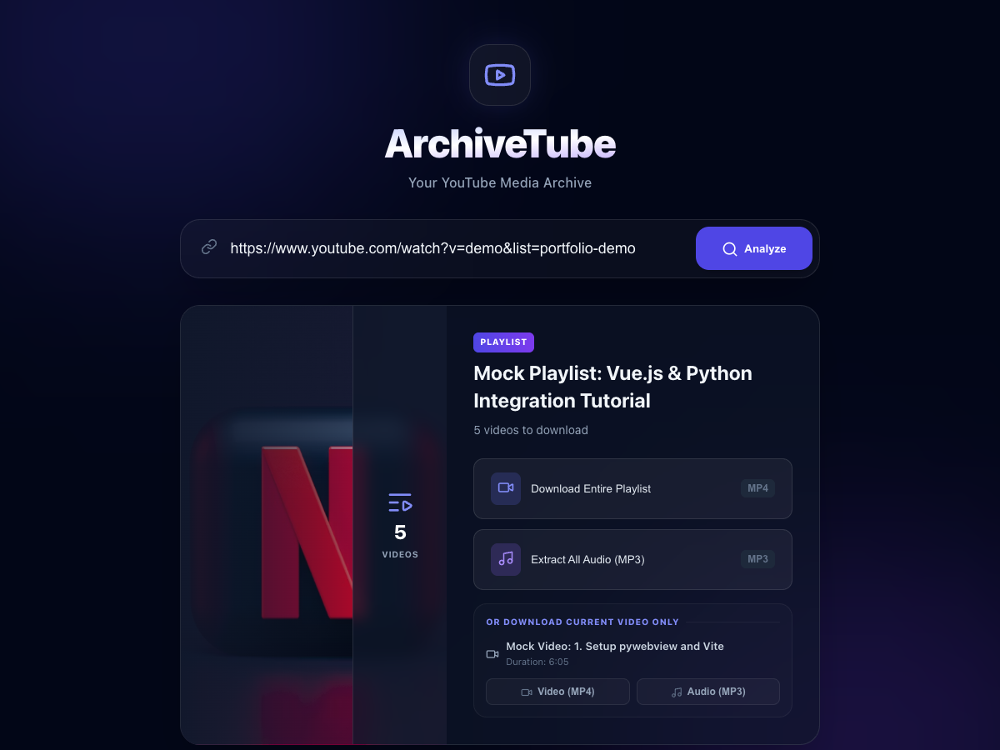
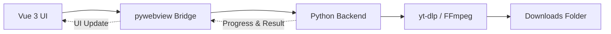

<div align="center">
  
  <h1>ArchiveTube</h1>
  <p>YouTube 영상과 재생목록을 MP4 또는 MP3로 정리해 보관하는 데스크톱 애플리케이션</p>

  <p>
    
    
    
    
    
  </p>
</div>



## 주요 기능

- 단일 YouTube 영상을 최고 품질 MP4로 저장
- 영상의 오디오를 192kbps MP3로 추출
- YouTube 재생목록 전체를 MP4 또는 MP3로 일괄 저장
- 영상과 재생목록이 함께 포함된 URL에서 전체 목록 또는 현재 영상 선택
- 재생목록별 폴더와 순번이 포함된 파일명 자동 생성
- 현재 항목, 전체 진행률, 성공·실패 개수를 실시간으로 표시
- 접근할 수 없는 항목을 건너뛰고 나머지 다운로드 계속 진행

## 애플리케이션 구조



## 기술 스택

| 영역 | 기술 |
| --- | --- |
| Frontend | Vue 3, Vite, SCSS, Lucide Icons |
| Desktop | Python 3, pywebview |
| Media | yt-dlp, imageio-ffmpeg, FFmpeg |
| Packaging | PyInstaller, Pillow |
| Test | Python unittest, yt-dlp mocking |

## 저장 규칙

다운로드 결과는 운영체제의 기본 `Downloads` 폴더에 저장됩니다.

```text
# 단일 영상
Downloads/영상 제목.mp4
Downloads/영상 제목.mp3

# 재생목록
Downloads/재생목록 제목/01 - 영상 제목.mp4
Downloads/재생목록 제목/02 - 영상 제목.mp4
```

## 프로젝트 구조

```text
ArchiveTube/
├── backend/                # Python 백엔드와 테스트
│   ├── main.py
│   └── tests/
├── frontend/               # Vue 3 사용자 인터페이스
│   ├── public/
│   └── src/
├── deploy/                 # 앱 빌드 스크립트와 패키징 문서
└── README.md
```

## 개발 환경 실행

### 요구 사항

- Python 3.10 이상
- Node.js 20.19 이상 또는 22.12 이상
- npm

### 1. Python 환경 준비

```bash
cd backend
python -m venv venv
```

macOS 또는 Linux:

```bash
source venv/bin/activate
pip install -r requirements.txt
```

Windows:

```powershell
venv\Scripts\activate
pip install -r requirements.txt
```

### 2. 개발 서버 실행

터미널 1 — Vue 개발 서버:

```bash
cd frontend
npm install
npm run dev
```

터미널 2 — 데스크톱 앱:

```bash
# macOS / Linux
backend/venv/bin/python backend/main.py

# Windows
backend/venv/Scripts/python.exe backend/main.py
```

## 테스트

```bash
# 백엔드 단위 테스트
backend/venv/bin/python -m unittest discover -s backend/tests -v

# 프런트엔드 프로덕션 빌드 검증
cd frontend
npm run build
```

## 데스크톱 앱 빌드

빌드 도구를 설치한 다음 프로젝트 루트에서 패키징 스크립트를 실행합니다.

```bash
backend/venv/bin/python -m pip install pyinstaller Pillow
backend/venv/bin/python deploy/build.py
```

| 운영체제 | 결과물 |
| --- | --- |
| macOS | `dist/ArchiveTube.app` |
| Windows | `dist/ArchiveTube.exe` |

macOS용 DMG 생성 방법은 [macOS 패키징 가이드](deploy/macOS_Packaging.md)를 참고하세요.

## 제한 사항 및 사용 안내

- YouTube의 API 및 정책 변경에 따라 다운로드가 일시적으로 실패할 수 있습니다.
- 호환성을 유지하려면 `yt-dlp`를 최신 버전으로 업데이트해야 합니다.
- 비공개, 연령 제한, 지역 제한 또는 로그인이 필요한 콘텐츠는 다운로드되지 않을 수 있습니다.
- ArchiveTube는 YouTube 또는 Google이 제작·승인·후원한 제품이 아닙니다.
- 본인이 다운로드 및 보관할 권한이 있는 콘텐츠에만 사용하고 YouTube 이용약관과 관련 법률을 준수하세요.
